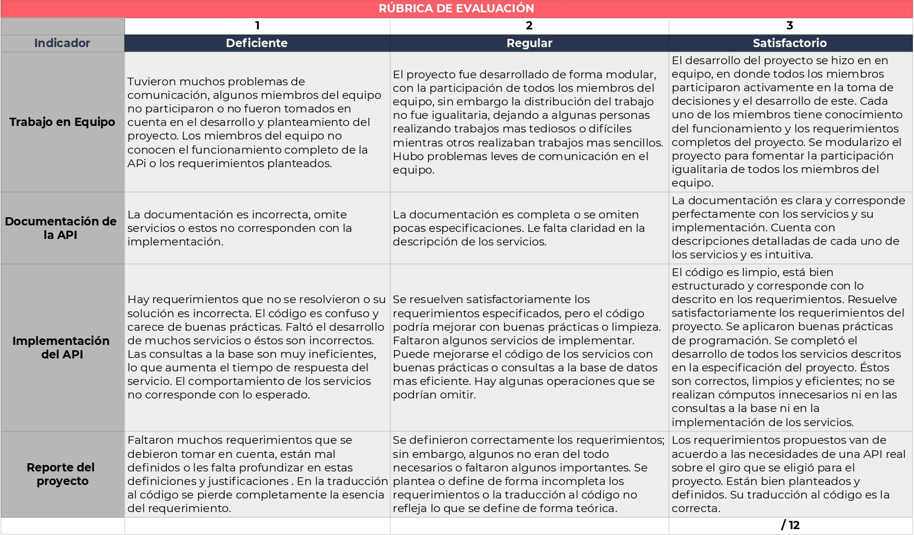

# Proyecto Backend Fundamentals

Este proyecto sirve para la evaluación del módulo. Se debe desarrollar en equipos. 

## Entregables: 

### 1. Reporte Escrito

Este reporte debe ser el archivo Readme.md del repositorio de GitHub en donde se encuentre el proyecto. Se deben abordar los siguientes puntos:

- Definir detalladamente las especificaciones del proyecto.
- Utilizar historias de usuario para definir el papel que jugaran.

### 2. API

Se debe desarrollar una API con las siguientes características:

- El tema es a elección de los alumnos.
- Una base de datos poblada con al menos 50 registros cada uno con un id.
- Como mínimo la API debe tener el CRUD completo con los siguientes servicios:
	- Servicio para crear un nuevo registro en la base.
	- Servicio para eliminar un registro.
	- Servicio para modificar un registro, se debe de considerar los casos de modifica- ciones por atributo, es decir, si los registros tienen un atributo nombre el servi- cio debe ser capaz de solo modificar el nombre. Así como una modificación total, es decir, de todos los atributos. Se recomienda definir servicios por separado para cada caso.
	- Consulta por id.
   	- Consulta de todos los registros.
	- Consulta por coincidencia de atributos, es decir, si los registros tienen un campo nombre el servicio debe ser capaz de regresar todos los registros que compartan el valor de nombre. Y esto debe funcionar en general para todos los campos de la base.
	- Servicio de consulta de todos los registros, limitado a un número determinado por el cliente.
	- Servicio de consulta por campos, es decir, un servicio que solo regrese los campos que se piden por el usuario.
- La API se debe desarrollar en Node.js.
- Utilizar un ORM/ODM para la conexión con la base de datos. 
- Hacer deploy de la API usando Heroku.

### 3. Swagger 

Un swagger son la documentación de la API.

- Documentar cada uno de los servicios desarrollados en una página de swagger para que
los usuarios puedan consultarla.
- Seguir todas las buenas prácticas y requerimientos para la documentación.

## Rúbrica de evaluación 

Para la evaluación del proyecto se usará la siguiente rúbrica:

