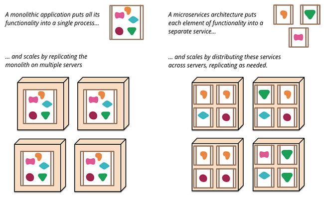
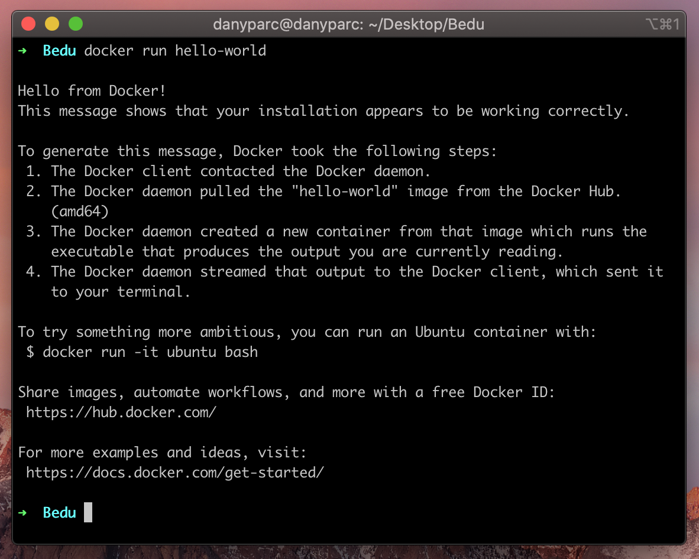
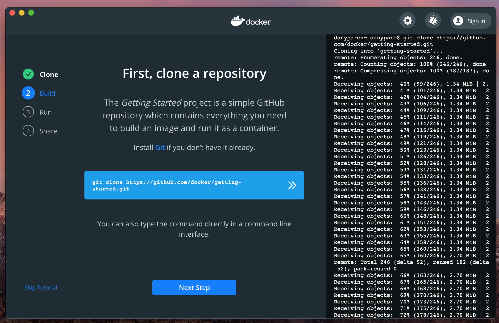
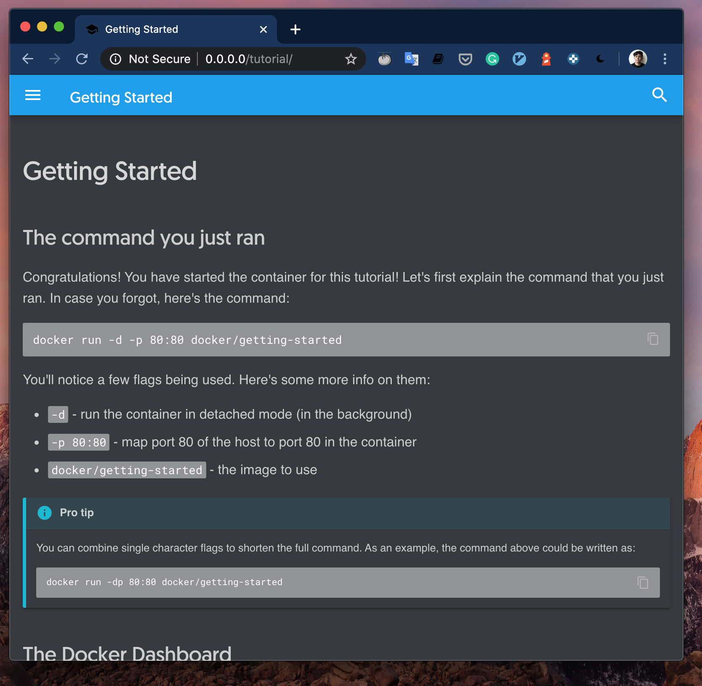

[`Backend Fundamentals`](../../README.md) > [`Sesión 03: Arquitectura de software`](../README.md) > `Postwork`

# Postwork

## Requerimientos

+ [Git](https://git-scm.com/downloads)

Recuerda que todo lo trabajado en tu prework, así como durante la sesión, puede ser aplicado a tu proyecto personal; Para lo cual, toma las siguientes consideraciones:

**Asegúrate de comprender:**

- El concepto de la arquitectura cliente-servidor.
- El reconocimiento de requerimientos funcionales y sus historias de usuario de tu aplicación.
- El patrón MVC ( Modelo Vista Controlador ).

Desarrollo en Java Script:
- Comienza a desarrollar las clases de las entidades identificadas en tu aplicación.

## Objetivo

- Entender las ventajas de una arquitectura basada en microservicios.
- Familiarizarse con Docker
- Descargar e instalar imagenes de docker y utilizarlas

Adicionalmente te aconsejamos leer los siguientes contenidos que ampliarán tus conocimientos:

## Desarrollo

## Arquitectura de Microservicios

La arquitectura de microservicios es un estilo de arquitectura dónde una aplicación es creada por medio de una colección de servicios pequeños que se ejecutan como procesos independientes.

Algunas de sus ventajas son:

- Mantenimiento más sencillo
- Gestión de datos descentralizada
- Se puede lanzar un nuevo microservicio y actualizarlo de manera independiente
- Cada microservicio es organizado en torno a las capacidades del negocio
- Cada microservicio puede ser gestionado por un equipo pequeño
- Escalamiento por componentes

Para entenderlo de una forma más sencilla podemos comparar los microservicios con una aplicación monolítica (Muy similar a la que planteamos anteriormente con el patrón MVC).



>💡 **Nota:**
>
> **Izquierda:**
>
> "Una aplicación monolítica que contiene todas sus funcionalidades en un único proceso y se escala replicando este monolito en múltiples servidores"
>
>**Derecha:**
>
>"En una arquitectura de Microservicios cada funcionalidad está en servicios separados y escala distribuyendo estos servicios entre servidores, replicando como se vaya requiriendo."

## **Docker**


Docker es una de las herramientas más populares para desarrollar microservicios.

Docker nos permite correr aplicaciones y gestionar los procesos de software en contenedores, cada contenedor funcionará cómo un entorno aislado que utilizará los recursos del sistema operativo dónde docker está instalado. Un contenedor es parecido a una máquina virtual, ya que los comandos que ejecutemos dentro de un contenedor no se verán reflejados en nuestro sistema operativo, pero sí se utilizarán los recursos de este mismo para correr este entorno de manera portable.

Una de las ventajas más importantes de esta plataforma es la portabilidad. Cuándo desarrollamos una imagen de docker basada en software existente podemos comenzar a desarrollar con la confianza de que una vez que hagamos las configuraciones pertinentes, nuestro software será ejecutado en un entorno con las mismas características sin importar si está en la nube o nuestra computadora.

También el ecosistema docker permite poner a trabajar distintos contenedores de manera conjunta. Una vez dominandolo, por ejemplo, cada equipo en una empresa puede comenzar a crear sus propios servicios y levantar las instancias de bases de datos que necesiten.

<!-- **Ejercicio**

1. Instalar docker en tu computadora siguiendo las instrucciones para la [instalación de docker](https://docs.docker.com/engine/install/)
2. Después de instalarlo y correr docker, para probar tu instalación ejecuta el comando:

    ```jsx
    docker run hello-world
    ```

    Deberás tener una salida similar a esta

    

    >💡 **Nota:**
    >
    >Si estás trabajando con docker desktops en Mac/windows al instalar docker puedes seguir su guía de inicio

    

3. Clona el repositorio de inicio con el siguiente comando

    ```jsx
    git clone https://github.com/docker/getting-started.git
    ```

    El proyecto "Getting started" es un repositorio de Github que contiene todo lo que necesitas para construir una imagen de Docker y correrla como contenedor.

4. Entra al repositorio y ejecuta este comando para construir tu imagen de prueba

    ```jsx
    docker build -t docker101tutorial .
    ```

    Una imagen de Docker es un archivo privado al que sólo puede accedeer tu contenedor, provee todos los archivos y el código que tu contenedor necesita.

5. Ejecuta tu primer contenedor

    ```jsx
    docker run -d -p 80:80 --name docker-tutorial docker101tutorial
    ```

    Inicia el contenedor basado en la imagen que construiste en el paso anterior. Correr el contenedor ejecuta tu aplicación con recursos privados, aislada del resto de tu ordenador.

6. Verifica que esté corriendo con `docker ps`
7. Si todo salió bien ahora podrás entrar a la dirección [http://0.0.0.0:80](http://0.0.0.0:80) y verás este pequeño servidor con una guía de inicio para docker

    

    En esta primera página nos explican más a detalle el comando que ejecutamos en el paso 5.

    - Con la opción (flag) `-d` indicamos que queremos que se ejecute nuestro contenedor en segundo plano.
    - Con el flag `-p 80:80` estamos *mapeando* el puerto ochenta de nuestra computadora al puerto 80 del contenedor.
    - En la siguiente sección de nuestro comando indicamos la imagen que queremos instalar ( `docker/getting-started` en este caso).

    Cabe aclarar que esta página fue *servida* por medio de un contenedor utilizando los recursos de nuestro sistema operativo

> ⚠️ **Importante**
>
>Si te interesa seguir aprendiendo a utilizar docker te recomendamos revisar la [documentación oficial](https://docs.docker.com/). -->

## Avances del Proyecto

Utilizando lo aprendido en la sesión 3, realicen los siguientes ejercicios como parte del desarrollo de tu proyecto:

1. Definan en equipo cuál sera la temática de su proyecto.
2. Definan los requerimientos del proyecto, así como su estructura, es decir, respondan las preguntas 
    - ¿Qué espero que haga el proyecto?
    - ¿Qué tipos de usuario tendrá nuestro sistema?
    - ¿Qué acciones puede realizar cada usuario?
    - ¿Qué información se necesita?
    - ¿Cuáles son las principales entidades?
    - ¿Qué características tiene cada entidad?
    - ¿Qué funcionalidades tiene cada entidad?
3. Utilicen historias de usuario para ayudarte a responder las preguntas del inciso anterior.
4. Definan en JavaScript las clases que representen cada entidad de su proyecto.
5. Crear un repositorio en Git de su proyecto, en donde se debe de subir todo el código.


